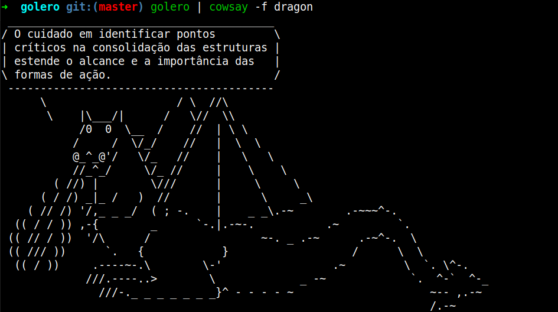

# golero



Based on the fabulous lero-lero generator (c)2001-2004 by Padre Levedo.

### Instalação

You need `go` installed and `GOBIN` in your `PATH`. Once that is done, run the
command:

```shell
$ go get -u github.com/thiamsantos/golero
```

## Usage

```sh
$ golero
```
